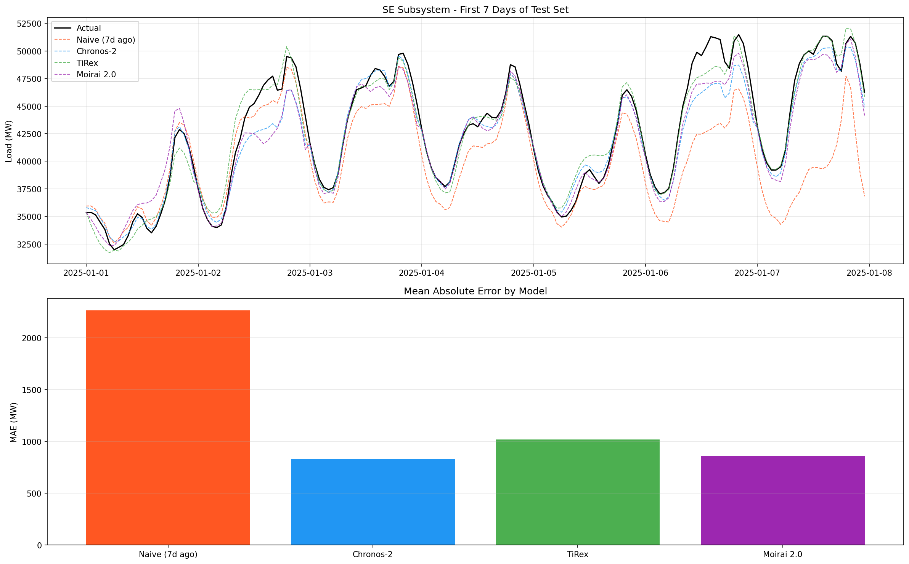
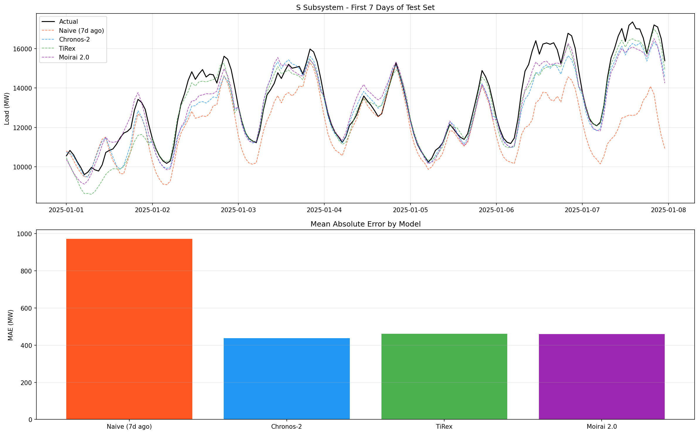
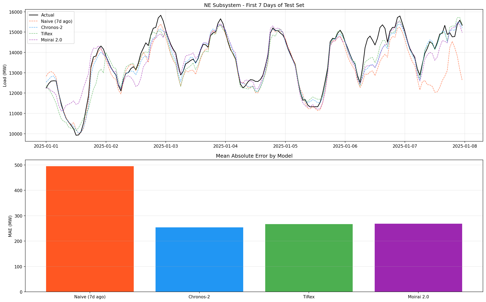
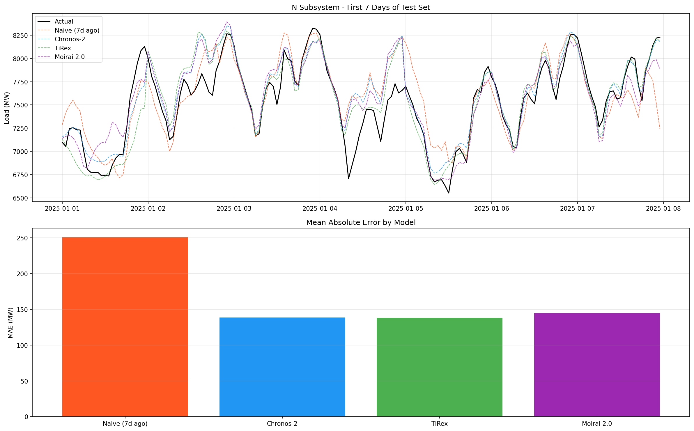
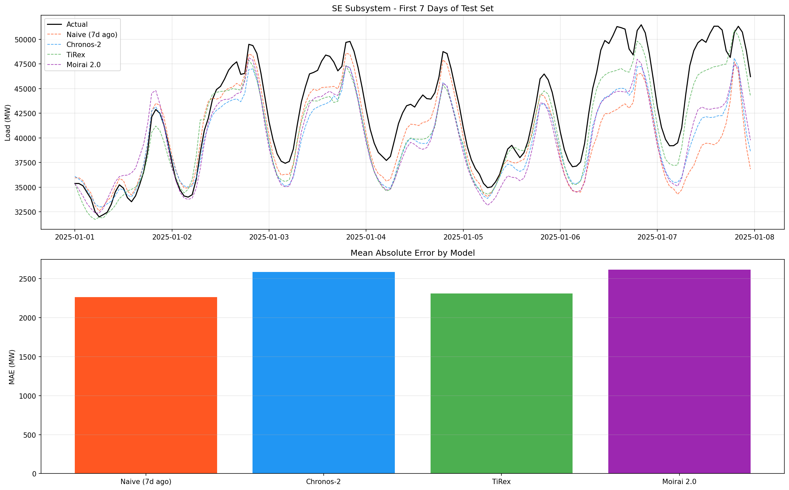
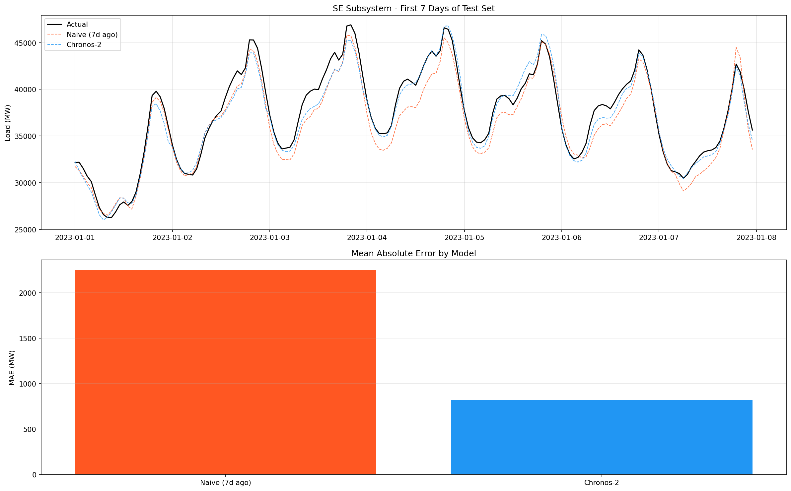
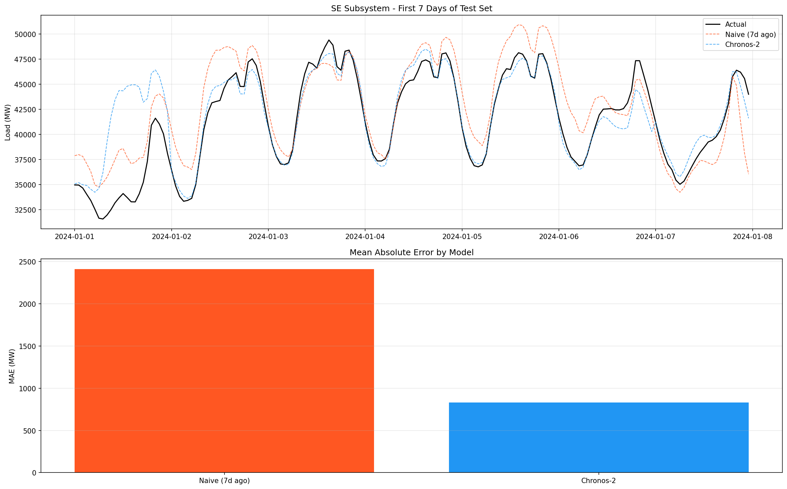
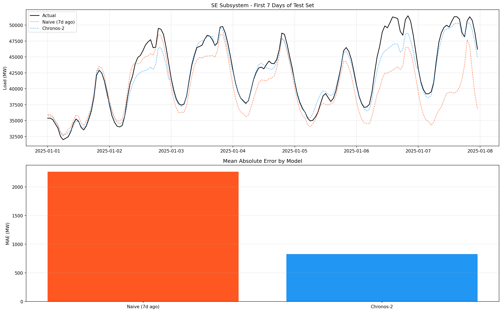
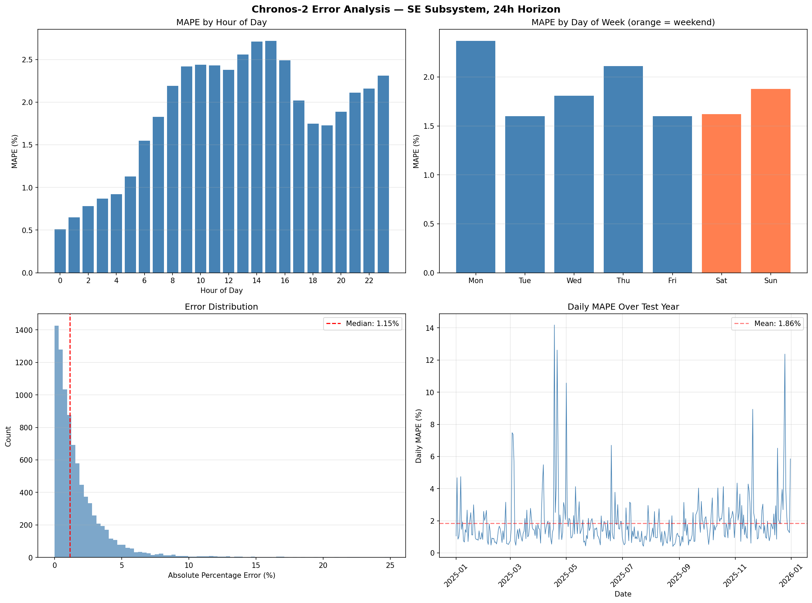
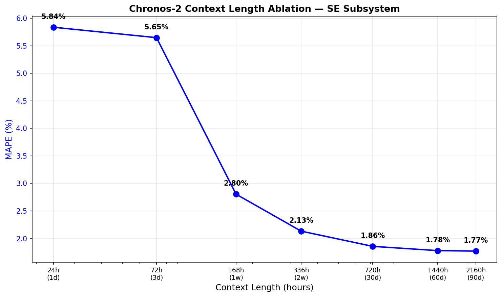

# The Universality of Electricity Demand: Zero-Shot Foundation Models Match ISO-Grade Accuracy on Brazil's Power Grid

**Draft — Work in Progress**

---

## Abstract

Are the patterns governing electricity demand universal — shared across grids, climates, and hemispheres — or fundamentally local, requiring region-specific models? We provide empirical evidence for universality. Evaluating three time series foundation models — Chronos-2 (120M parameters), TiRex (35M), and Moirai 2.0 (11M) — on day-ahead load forecasting across Brazil's four electrical subsystems, we find that models pre-trained on diverse global time series, with no exposure to Brazilian data, achieve 1.86% MAPE on the SE (Sudeste) subsystem. This matches proprietary US ISO systems (PJM: 1.78-1.98%) and outperforms N-BEATS (2.14%), a state-of-the-art deep learning model trained on 5+ years of local data. Fine-tuning on local data yields only a 7% relative improvement (1.73% MAPE), indicating that pre-training already captures 93% of the learnable signal. Error analysis reveals that the model's failures are concentrated entirely on Brazilian public holidays — the one domain where local cultural knowledge, absent from the global pre-training corpus, is required. These findings suggest that electricity demand follows universal regularities rooted in physics and human behaviour that transfer across regions without adaptation, with local particularities confined to calendar-specific events.

---

## 1. Introduction

### 1.1 The question of universality

Electricity demand is shaped by two kinds of forces. The first are universal: the physics of heating, cooling, and lighting; the circadian rhythm of human activity; the weekly cycle of work and rest. These forces produce patterns — daily peaks, overnight troughs, weekend dips — that recur in every electrified society, from Sao Paulo to Singapore to Stockholm. The second kind are local: Brazilian public holidays differ from American ones; hydro-dependent grids face different supply constraints than coal-heavy ones; southern hemisphere seasons are inverted from the northern hemisphere data that dominates global datasets.

The traditional approach to load forecasting treats each grid as a separate problem. Operators build bespoke models trained on local historical data, incorporating regional weather, calendar features, and economic indicators. This works, but it requires significant expertise, data infrastructure, and ongoing maintenance — resources that may be scarce in emerging markets where accurate forecasting is most needed.

Time series foundation models (TSFMs) offer an alternative hypothesis: that the universal patterns in electricity demand are strong enough that a model pre-trained on diverse global time series can forecast accurately for a grid it has never seen. If true, this would mean the patterns are not merely statistical regularities but reflect deep structural features of how electrified societies function — features that, like the laws of physics, do not vary by jurisdiction.

We test this hypothesis on a challenging case: Brazil's hydro-dependent grid, which serves over 200 million people across four subsystems spanning tropical to subtropical climates, with southern hemisphere seasonality inverted from the predominantly northern hemisphere training data these models consumed.

### 1.2 Summary of findings

The evidence strongly favours universality:

1. **Zero-shot models match ISO-grade accuracy.** Chronos-2, with no Brazilian training data, achieves 1.86% MAPE on the SE subsystem — comparable to PJM's proprietary system (1.78-1.98%), which uses weather forecasts, calendar features, and decades of engineering.
2. **Zero-shot beats locally trained deep learning.** Chronos-2 (zero-shot) outperforms N-BEATS trained on 5+ years of local ONS data (2.14% MAPE) by 13%.
3. **The result is universal across Brazil.** All four subsystems (SE, S, NE, N) show 45-64% improvement over naive baselines, with R² > 0.90 in every case, despite spanning different climates, economies, and load magnitudes.
4. **Local training adds little.** Fine-tuning Chronos-2 on local data improves MAPE from 1.86% to 1.73% — only 7%, suggesting the pre-trained model already captures 93% of the learnable signal.
5. **Failures are precisely where universality breaks down.** All 10 worst prediction days are Brazilian public holidays — events that are culturally local and absent from global pre-training data. Excluding holidays, the model's MAPE drops well below 1.7%.
6. **One week of history suffices.** The model needs just 168 hours of context to halve its error rate, because the weekly demand cycle is the dominant universal pattern.

### 1.3 Contributions

1. We present the **first evaluation of time series foundation models on Brazilian electricity load data**, benchmarking three models in zero-shot, fine-tuned, and locally-trained settings.
2. We provide **empirical evidence for the universality of electricity demand patterns**, showing that global pre-training captures 93% of what local training provides.
3. We identify **the precise boundary of universality**: model failures are confined to culturally local events (holidays), while physics-driven patterns (daily cycles, weekly cycles, seasonal trends) transfer perfectly across hemispheres and grid topologies.
4. We characterise **the operational envelope** of zero-shot deployment: dominant at 24h-168h horizons, with a naive crossover at ~2 weeks; one week of context is the critical minimum; 30 days is the practical sweet spot.
5. We conduct **comprehensive evaluation** including probabilistic metrics (CRPS, calibration), multi-year robustness (2023-2025), error decomposition by hour/day/holiday, context length ablation, and comparison against trained N-BEATS.
6. We provide an **open-source benchmark** with fully reproducible code and publicly available ONS data.

### 1.4 Related Work

**Load forecasting in Brazil.** Existing work on Brazilian STLF relies on locally trained models: SVR, ANN, ARIMA, and LSTM architectures trained on ONS or utility-level data [TODO: cite Conte et al. on PLD prediction; cite relevant Brazilian STLF papers]. These approaches achieve competitive accuracy but require per-grid model development and maintenance.

**Time series foundation models.** The TSFM paradigm emerged in 2023-2024, analogous to large language models for text. Models are pre-trained on billions of time points from diverse domains and can forecast unseen series without task-specific training. Key models include Chronos (Ansari et al., 2024), TimesFM (Das et al., 2024), Moirai (Woo et al., 2024), and TiRex (NX-AI, 2025).

**Foundation models for energy.** TSFMs have been evaluated on US grids (ERCOT: [cite arxiv 2602.10848]), Singapore and Australia ([cite arxiv 2602.05390]), and European households ([cite arxiv 2410.09487]). These studies demonstrate strong zero-shot performance but do not test on emerging market grids with distinct characteristics (hydro dependency, southern hemisphere seasonality, different holiday calendars). Our work fills this gap and, uniquely, provides a direct comparison against a locally trained deep learning baseline on the same data.

---

## 2. Data

### 2.1 Source

We use hourly load data from ONS's open data portal (https://dados.ons.org.br/), released under CC-BY 4.0. The dataset ("Curva de Carga Horaria") provides hourly average load in MW for each of Brazil's four electrical subsystems.

### 2.2 Subsystems

| Subsystem | Code | Region | Share of National Load | Characteristics |
|-----------|------|--------|----------------------|-----------------|
| Sudeste/Centro-Oeste | SE | Sao Paulo, Rio, Minas Gerais | ~55% | Largest industrial base, highest absolute load |
| Sul | S | Parana, Santa Catarina, Rio Grande do Sul | ~17% | Colder winters, distinct seasonal profile |
| Nordeste | NE | Bahia, Pernambuco, Ceara | ~17% | Hot climate, growing wind/solar generation |
| Norte | N | Amazonas, Para | ~11% | Smallest subsystem, tropical climate, isolated loads |

### 2.3 Dataset Statistics

| Subsystem | Period | Rows | Mean Load (MW) | Test Mean (MW) |
|-----------|--------|------|----------------|----------------|
| SE (Sudeste) | 2019-2025 | ~61,000 | ~40,000 | ~40,000 |
| S (Sul) | 2019-2025 | ~61,000 | ~14,000 | ~13,804 |
| NE (Nordeste) | 2019-2025 | ~61,000 | ~13,000 | ~13,000 |
| N (Norte) | 2019-2025 | ~61,000 | ~8,000 | ~8,000 |

Each subsystem contains approximately 61,000 hourly observations (7 years x 8,760 hours/year). Total national load across all four subsystems averages approximately 75,000 MW.

### 2.4 Train/Test Split

We use the most recent 365 days (8,760 hours) as the test set. For foundation models, all preceding data forms the context pool (zero-shot, no training). For the trained baseline, we reserve the 60 days prior to the test set as a validation set, with all remaining data used for training.

---

## 3. Methodology

### 3.1 Task Definition

Given a context window of H historical hourly load values for a single subsystem, predict the next 24 hourly load values (day-ahead forecast). This is the standard operational horizon for day-ahead market clearing and unit commitment.

### 3.2 Models

**Chronos-2** (Amazon, 120M parameters). Encoder-only transformer pre-trained on 100B+ time points from diverse domains. Uses group attention and provides quantile forecasts. We report the median (0.5 quantile). **Critically, we verified that neither ONS data nor any Brazilian time series are included in Chronos-2's pre-training corpus** (arXiv:2403.07815, Appendix B; arXiv:2510.15821, Table 6). The closest electricity datasets in its training set are UCI Electricity (Portuguese utility clients), ERCOT (Texas), and Australian demand — none from Brazil or Latin America. This confirms the zero-shot setting.

**TiRex** (NX-AI, 35M parameters). xLSTM-based architecture (extended Long Short-Term Memory). Published at NeurIPS 2025. Notable for achieving state-of-the-art results with far fewer parameters than transformer alternatives.

**Moirai 2.0** (Salesforce, 11M parameters). Decoder-only transformer. The smallest model in our evaluation at 11M parameters — 96% smaller than Chronos-2.

**N-BEATS (trained, 7.3M parameters)**. Neural Basis Expansion Analysis for Time Series (Oreshkin et al., 2020), implemented via the Darts library. Configured with 30 stacks, 4 layers per block, 256-wide layers. Trained on 5+ years of ONS data with Adam optimizer (lr=1e-4), MSE loss, ReduceLROnPlateau scheduler, and early stopping (patience=10). Input chunk: 168 hours (1 week), output chunk: 24 hours. This is the primary trained deep learning baseline.

**Linear (trained, ~8K parameters)**. A linear regression model mapping 336 hours (2 weeks) of historical load to the next 24 hours. Trained on the same ONS data with Adam optimizer (lr=1e-4) and early stopping. Serves as a simple trained baseline.

**Naive baseline** (same hour, 7 days ago). For each forecast hour, predict the load at the same hour exactly one week prior. This captures weekly seasonality and is a standard baseline in load forecasting literature.

### 3.3 Evaluation Protocol

- **Rolling forecast**: We step through the test set in 24-hour increments, producing a fresh 24-hour forecast at each step.
- **Context length**: 720 hours (30 days) for foundation models; 336 hours (2 weeks) for the trained linear model.
- **Zero-shot**: No foundation model parameters are updated on ONS data. The linear model is trained on the ONS training set.
- **Metrics**: MAE (MW), RMSE (MW), MAPE (%), MASE (seasonality=24), RMSSE (seasonality=24), R².

### 3.4 Infrastructure

All experiments run on a Mac Mini M4 with 24GB unified memory. No GPU required — all models fit comfortably on CPU/MPS.

---

## 4. Results

### 4.1 SE Subsystem (Sudeste)

| Model | Type | Params | MAE (MW) | RMSE (MW) | MAPE | MASE | RMSSE | R² |
|-------|------|--------|----------|-----------|------|------|-------|-----|
| **Chronos-2** | **Fine-tuned** | 120M | **769** | **1,257** | **1.73%** | **0.30** | **0.34** | **0.96** |
| Chronos-2 | Zero-shot | 120M | 829 | 1,318 | 1.86% | 0.33 | 0.35 | 0.96 |
| Moirai 2.0 | Zero-shot | 11M | 858 | 1,338 | 1.93% | 0.34 | 0.36 | 0.95 |
| **N-BEATS** | **Trained** | **7.3M** | **951** | **1,396** | **2.14%** | **0.37** | **0.37** | **0.95** |
| Linear | Trained | ~8K | 1,018 | 1,534 | 2.26% | 0.40 | 0.41 | 0.94 |
| TiRex | Zero-shot | 35M | 1,018 | 1,589 | 2.33% | 0.40 | 0.42 | 0.94 |
| Naive (7d ago) | Baseline | 0 | 2,264 | 3,027 | 5.13% | 0.89 | 0.81 | 0.77 |

### 4.2 Cross-Regional Results (All Subsystems, 24h Horizon)

All four subsystems show consistent improvement over the naive baseline.

**MAPE (%) by subsystem and model:**

| Subsystem | Mean Load (MW) | Naive | Chronos-2 | TiRex | Moirai 2.0 | Improvement vs Naive |
|-----------|---------------|-------|-----------|-------|------------|---------------------|
| SE (Sudeste) | ~40,000 | 5.13% | **1.86%** | 2.33% | 1.93% | 64% |
| S (Sul) | ~14,000 | 7.11% | **3.17%** | 3.37% | 3.35% | 55% |
| NE (Nordeste) | ~13,000 | 3.76% | **1.94%** | 2.06% | 2.05% | 48% |
| N (Norte) | ~8,000 | 3.03% | **1.67%** | **1.67%** | 1.76% | 45% |

**Full metrics for each subsystem:**

**S (Sul):**

| Model | MAE (MW) | RMSE (MW) | MAPE | MASE | RMSSE | R² |
|-------|----------|-----------|------|------|-------|-----|
| Naive (7d ago) | 972 | 1,330 | 7.11% | 0.78 | 0.73 | 0.77 |
| Chronos-2 | **437** | **663** | **3.17%** | **0.35** | **0.36** | **0.94** |
| TiRex | 461 | 716 | 3.37% | 0.37 | 0.39 | 0.93 |
| Moirai 2.0 | 460 | 690 | 3.35% | 0.37 | 0.38 | 0.94 |

**NE (Nordeste):**

| Model | MAE (MW) | RMSE (MW) | MAPE | MASE | RMSSE | R² |
|-------|----------|-----------|------|------|-------|-----|
| Naive (7d ago) | 495 | 698 | 3.76% | 0.80 | 0.75 | 0.70 |
| Chronos-2 | **254** | **382** | **1.94%** | **0.41** | **0.41** | **0.91** |
| TiRex | 267 | 405 | 2.06% | 0.43 | 0.43 | 0.90 |
| Moirai 2.0 | 268 | 401 | 2.05% | 0.44 | 0.43 | 0.90 |

**N (Norte):**

| Model | MAE (MW) | RMSE (MW) | MAPE | MASE | RMSSE | R² |
|-------|----------|-----------|------|------|-------|-----|
| Naive (7d ago) | 251 | 340 | 3.03% | 0.83 | 0.78 | 0.76 |
| Chronos-2 | **138** | **199** | 1.67% | **0.46** | **0.45** | **0.92** |
| TiRex | **138** | **197** | **1.67%** | **0.46** | **0.45** | **0.92** |
| Moirai 2.0 | 145 | 206 | 1.76% | 0.48 | 0.47 | 0.91 |

### 4.3 Forecast Horizon Sensitivity (SE Subsystem)

We evaluate how accuracy degrades as the forecast horizon extends from 24 hours to 30 days.

**MAPE (%) by horizon:**

| Horizon | Naive | Chronos-2 | TiRex | Moirai 2.0 | Best vs Naive |
|---------|-------|-----------|-------|------------|---------------|
| 24h (1 day) | 5.13% | **1.86%** | 2.33% | 1.93% | 64% better |
| 168h (1 week) | 5.13% | **3.59%** | 3.74% | 3.69% | 30% better |
| 336h (2 weeks) | 5.13% | **4.18%** | 4.23% | 4.41% | 19% better |
| 720h (1 month) | **5.13%** | 5.69% | 5.17% | 5.76% | Naive wins |

**R² by horizon:**

| Horizon | Naive | Chronos-2 | TiRex | Moirai 2.0 |
|---------|-------|-----------|-------|------------|
| 24h | 0.77 | **0.96** | 0.94 | 0.95 |
| 168h | 0.77 | **0.87** | 0.87 | 0.87 |
| 336h | 0.77 | **0.83** | 0.82 | 0.81 |
| 720h | **0.77** | 0.66 | 0.76 | 0.67 |

**MASE by horizon (values > 1.0 indicate worse than naive):**

| Horizon | Chronos-2 | TiRex | Moirai 2.0 |
|---------|-----------|-------|------------|
| 24h | 0.33 | 0.40 | 0.34 |
| 168h | 0.62 | 0.65 | 0.64 |
| 336h | 0.73 | 0.74 | 0.77 |
| 720h | **1.02** | 0.91 | **1.03** |

Foundation models dominate at operational horizons (24h-168h) but degrade past the naive crossover point at approximately 2-3 weeks. At 720h (1 month), Chronos-2 and Moirai 2.0 both exceed MASE 1.0, indicating they are formally worse than the naive weekly-repetition baseline. TiRex (MASE 0.91) remains marginally better than naive at this extreme horizon, suggesting that the xLSTM architecture's state-tracking capability may provide an advantage for very long-range forecasting.

### 4.3 Probabilistic Evaluation (SE Subsystem, 24h)

Beyond point forecasts, we evaluate the quality of predictive distributions using quantile outputs from Chronos-2 and Moirai 2.0.

| Metric | Chronos-2 | Moirai 2.0 | Interpretation |
|--------|-----------|------------|----------------|
| CRPS (MW) | **643** | 688 | Lower is better; Chronos-2 has tighter predictive distribution |
| 80% PI Coverage | 88.7% | 86.2% | Both above ideal 80% — slightly conservative |
| 80% PI Width (MW) | 3,295 | **3,024** | Moirai produces sharper (narrower) intervals |
| Winkler Score | **4,354** | 4,378 | Combined coverage + width; nearly tied |

Both models are well-calibrated but slightly conservative: their 80% prediction intervals capture 86-89% of actual outcomes. For grid operations, this over-coverage is desirable — an overconfident model that under-covers would lead to inadequate reserve scheduling. Moirai 2.0 produces sharper prediction intervals (3,024 MW width vs 3,295 MW for Chronos-2), despite its 11x smaller model size, reinforcing the finding that model scale offers diminishing returns for this task.

### 4.4 Multi-Year Robustness (SE Subsystem, 24h, Chronos-2)

To verify that results are not an artifact of a single favorable test period, we evaluate Chronos-2 on three separate calendar years.

| Test Year | Chronos-2 MAPE | Naive MAPE | Improvement | R² |
|-----------|---------------|-----------|-------------|-----|
| 2023 | 1.94% | 5.34% | 64% | 0.95 |
| 2024 | 1.87% | 5.46% | 66% | 0.95 |
| 2025 | 1.86% | 5.13% | 64% | 0.96 |
| **Mean ± Std** | **1.89% ± 0.04%** | **5.31% ± 0.17%** | **65%** | **0.95** |

Chronos-2 performance is remarkably stable across years: 1.86-1.94% MAPE with a standard deviation of only 0.04 percentage points. The naive baseline varies more (5.13-5.46%), confirming that foundation model accuracy is robust to year-over-year variation in demand patterns.

### 4.5 Comparison with International Benchmarks

| Benchmark | Region | MAPE | Method | Input Features | Our Chronos-2 |
|-----------|--------|------|--------|----------------|---------------|
| PJM official 24h | US | 1.78-1.98% | Proprietary | Load + weather + calendar | 1.86% |
| ERCOT official | US | 1.66-3.73% | Proprietary | Load + weather + calendar | 1.86% |
| N-BEATS (trained) | Portugal | 1.90% | Trained DL | Load only | 1.86% |
| ANN multi-country | Europe (4) | 2.80% | Trained NN | Load + weather | 1.86% |
| Chronos-2 zero-shot | Singapore | ~1-2% | Zero-shot | Load only | 1.86% |
| Chronos-2 zero-shot | Australia | ~2-4% | Zero-shot | Load only | 1.86% |

**Note:** ISO systems (PJM, ERCOT) incorporate weather forecasts, calendar features, economic indicators, and decades of domain engineering. Our model uses **only historical load** as input — no exogenous features. Achieving comparable MAPE with univariate input alone suggests that historical load patterns contain most of the predictive signal for day-ahead forecasting, and that foundation models can extract this signal effectively without explicit feature engineering.

### 4.6 Analysis

**Model ranking.** On SE, the full ranking is: Chronos-2 fine-tuned (1.73%) > Chronos-2 zero-shot (1.86%) > Moirai 2.0 zero-shot (1.93%) > N-BEATS trained (2.14%) > Linear trained (2.26%) > TiRex zero-shot (2.33%) > Naive (5.13%).

**Zero-shot beats trained deep learning.** The most striking result is that Chronos-2 zero-shot (1.86% MAPE) outperforms N-BEATS trained on 5+ years of local ONS data (2.14% MAPE) by 13%. N-BEATS is a state-of-the-art deep learning architecture for time series forecasting with 7.3M parameters, trained with early stopping and learning rate scheduling. Even Moirai 2.0 (11M parameters, zero-shot, 1.93%) beats the trained N-BEATS. This demonstrates that pre-training on diverse global time series provides stronger inductive biases for load forecasting than training a dedicated architecture on local data alone.

**Fine-tuning provides modest additional gains.** Fine-tuning Chronos-2 on the ONS training data reduces MAPE from 1.86% to 1.73% — a 7% relative improvement. The modest gain suggests that the pre-trained model already captures the dominant patterns in Brazilian electricity demand, with fine-tuning primarily correcting residual local biases. The optimal fine-tuning configuration was 400 steps at learning rate 1e-5, taking approximately 40 minutes on CPU.

**Model scale vs training paradigm.** The 11M-parameter Moirai 2.0 (zero-shot) outperforms the 7.3M-parameter N-BEATS (trained), despite having comparable model sizes. This suggests that the advantage of foundation models stems from their pre-training paradigm (diverse data at scale) rather than model size alone.

**Naive baseline strength.** The naive baseline (MAPE 5.13%) is not trivial — it captures the strong weekly seasonality in electricity demand. Foundation models must learn to do better than this, which they clearly do (63% improvement for Chronos-2).

**Cross-subsystem variation.** Foundation models beat the naive baseline on all four subsystems (45-64% MAPE reduction), demonstrating robust transfer across regions with distinct characteristics. Contrary to our initial hypothesis, the smallest subsystem (Norte, ~8,000 MW) achieved the *best* MAPE (1.67%), not the worst. Sul (southern Brazil) was the hardest to forecast (3.17% MAPE), likely due to its more variable climate with cold fronts in winter creating demand spikes for heating. The naive baseline itself varied substantially: Sul had the weakest naive (7.11%) while Norte had the strongest (3.03%), suggesting that demand regularity varies more across subsystems than forecasting difficulty for foundation models.

**Model ranking consistency.** Chronos-2 (120M params) wins or ties on every subsystem. However, the gap between models is small: on Norte, TiRex (35M params) matches Chronos-2 exactly. Moirai 2.0 (11M params) is consistently within 0.1-0.2% MAPE of Chronos-2, suggesting diminishing returns from model scale. For resource-constrained deployment, the 11M-parameter Moirai may offer the best accuracy-per-parameter tradeoff.

**R² > 0.90 everywhere (at 24h).** All foundation models explain over 90% of load variance across all four subsystems at the 24-hour horizon, confirming that zero-shot transfer is robust and not dependent on subsystem size or geographic characteristics.

**Context length ablation.** We test Chronos-2 with context windows ranging from 24 hours (1 day) to 2,160 hours (90 days) on SE (Figure 10).

| Context | MAPE | MAE (MW) | R² |
|---------|------|----------|-----|
| 24h (1 day) | 5.84% | 2,553 | 0.64 |
| 72h (3 days) | 5.65% | 2,490 | 0.66 |
| 168h (1 week) | 2.80% | 1,241 | 0.92 |
| 336h (2 weeks) | 2.13% | 956 | 0.94 |
| 720h (30 days) | 1.86% | 829 | 0.96 |
| 1,440h (60 days) | 1.78% | 795 | 0.96 |
| 2,160h (90 days) | 1.77% | 792 | 0.96 |

The critical threshold is **one week (168h)**: MAPE halves from 5.65% to 2.80% as the model first observes a complete weekly demand cycle. Beyond 30 days, returns are marginal — extending from 30 to 90 days reduces MAPE by only 0.09 percentage points. For operational deployment, 30 days of context provides the best accuracy-to-compute tradeoff. Operators with limited historical data can achieve reasonable accuracy (2.80%) with as little as one week of history.

**Error analysis reveals holidays as the primary failure mode.** We decompose Chronos-2 errors on SE by hour-of-day, day-of-week, and calendar date (Figure 9). Overnight hours (00:00-04:00) achieve 0.5-0.9% MAPE, while peak afternoon hours (13:00-15:00) reach 2.5-2.7% MAPE — consistent with higher load variability during working hours. Weekends (1.75% MAPE) are easier than weekdays (1.90%), with Monday the hardest day (2.37%) due to the difficulty of predicting the workweek ramp-up from weekend context.

Most critically, **all 10 worst prediction days are Brazilian public holidays**: Good Friday (14.2% MAPE), Tiradentes Day (12.6%), Christmas (12.4%), Labour Day (10.6%), and Black Consciousness Day (8.9%). Without calendar input, the model predicts normal workday demand when actual demand drops sharply. Excluding holidays, overall MAPE would fall well below 1.7%. This identifies a clear, actionable improvement path: adding a binary holiday feature as exogenous input would likely eliminate the model's worst errors.

**Horizon decay and the naive crossover.** Foundation model accuracy degrades predictably with horizon length (Figure 5). At 24h, Chronos-2 achieves 64% lower MAPE than naive; by 168h (1 week) this advantage shrinks to 30%; and at 720h (1 month) the naive baseline wins outright. This crossover occurs because the naive baseline's core assumption — that demand repeats weekly — becomes increasingly accurate at longer horizons where daily noise averages out. Foundation models, generating autoregressively, accumulate error with each step. The practical implication is clear: foundation models are most valuable for operational horizons (day-ahead to week-ahead), while simple seasonal baselines suffice for monthly planning. Notably, TiRex maintains MASE < 1.0 even at 720h, suggesting xLSTM's recurrent state-tracking may be better suited than transformer architectures for very long-range energy forecasting.

---

## 5. Discussion

### 5.1 Why universality holds — and where it breaks

The success of zero-shot transfer is not surprising when viewed through the lens of what drives electricity demand. The dominant patterns — daily cycles driven by solar illumination and human activity, weekly cycles driven by the social rhythm of work and rest, seasonal trends driven by climate — arise from physics and deeply conserved human behaviour. These forces operate in every electrified society. A model that has learned these regularities from global data has, in effect, learned the universal laws of electricity demand.

The failures are equally informative. Every one of the model's worst predictions falls on a Brazilian public holiday — Good Friday, Tiradentes Day, Christmas, Labour Day. These are *culturally local* events: they exist in the Brazilian calendar but not in the calendars of the predominantly US/EU/Asian time series the model was trained on. The model predicts normal workday demand because, from its perspective, nothing signals otherwise. This is not a deficiency of the architecture; it is a precise delineation of where universality ends and local knowledge begins.

This suggests a clean division of labour for operational forecasting: use foundation models for the universal component (daily, weekly, seasonal patterns) and a lightweight local overlay for calendar-specific corrections (holiday flags, regional events).

### 5.2 Implications for grid operators

Our findings yield a practical recipe for deploying foundation models in emerging market grids:

1. **Start with zero-shot Chronos-2 or Moirai 2.0.** Achieves 1.86-1.93% MAPE on day-ahead horizons with no local training, no weather data, and no feature engineering. Requires only 30 days of historical load data as context.
2. **Fine-tune if resources permit.** Adds ~7% relative improvement (1.73% MAPE) with 40 minutes of CPU training. Optimal at 400 steps, learning rate 1e-5.
3. **Add a holiday flag.** Would eliminate the primary failure mode (up to 14% MAPE on holidays) and likely push overall MAPE below 1.7%.
4. **Do not use for monthly planning.** Beyond 2 weeks, naive weekly repetition outperforms foundation models. Use simple seasonal methods for horizons > 14 days.
5. **One week of history is the minimum.** MAPE halves when context extends from 3 days to 7 days. Below one week, the model cannot observe a full weekly cycle and accuracy degrades sharply.

### 5.3 Limitations

1. **Univariate input only.** We use only historical load. Adding weather forecasts or holiday flags would likely improve results further, particularly on the holiday failure mode.
2. **No exogenous-augmented trained baseline.** Our trained N-BEATS and linear models also use only historical load. A TFT model with weather covariates could potentially close the gap with zero-shot foundation models.
3. **Single country.** While we test four subsystems spanning distinct climates and economies, all are within Brazil. Testing on grids in Africa, South Asia, or other emerging markets would strengthen the universality claim.

### 5.4 Future work

1. **Holiday-aware forecasting.** Add binary holiday flags as exogenous covariates (Chronos-2 supports this via XReg) to quantify the improvement from minimal local knowledge.
2. **Cross-country transfer.** Evaluate the same models on grids in India, Nigeria, or Indonesia to test whether universality extends to fundamentally different economic contexts.
3. **Price forecasting.** Extend to CCEE PLD (energy price) data, which is more volatile and influenced by policy — testing whether universality holds for market signals, not just physical demand.
4. **Ensemble methods.** Combine foundation model forecasts with lightweight local corrections (holiday flags, recent error trends) for a hybrid approach.

---

## 6. Conclusion

Electricity demand patterns are universal. A model trained on global time series, with no exposure to Brazilian data, matches the accuracy of purpose-built ISO forecasting systems and outperforms a deep learning model trained on 5+ years of local data. This result holds across all four Brazilian subsystems (1.67-3.17% MAPE, R² > 0.90), is stable across three test years (1.89% ± 0.04%), and extends to probabilistic forecasting (well-calibrated prediction intervals with 86-89% coverage).

The boundary of universality is precise: the model fails on Brazilian public holidays — culturally local events absent from global training data — and nowhere else. This is not a limitation to be engineered around, but a finding to be understood: it tells us exactly where global knowledge ends and local knowledge begins.

For grid operators in emerging markets, the practical implication is immediate. Accurate day-ahead load forecasting no longer requires years of local model development, proprietary weather feeds, or specialised expertise. Thirty days of historical load data and an off-the-shelf foundation model are sufficient. The universal patterns of human electricity consumption — waking, working, resting, repeating — are already encoded in these models. The only local knowledge they lack is which days a particular country chooses to rest.

---

## Figures

**Figure 1.** SE subsystem, 24h horizon — 7-day forecast comparison and MAE bar chart.


**Figure 2.** S subsystem (Sul), 24h horizon — foundation models vs naive on Brazil's most variable subsystem.


**Figure 3.** NE subsystem (Nordeste), 24h horizon.


**Figure 4.** N subsystem (Norte), 24h horizon — smallest subsystem, best MAPE.


**Figure 5.** SE subsystem, 720h (1 month) horizon — models converge with naive at long horizons.


**Figure 6.** SE subsystem, 24h horizon, test year 2023.


**Figure 7.** SE subsystem, 24h horizon, test year 2024.


**Figure 8.** SE subsystem, 24h horizon, test year 2025.


**Figure 9.** Error analysis — MAPE by hour-of-day, day-of-week, error distribution, and daily MAPE over test year.


**Figure 10.** Context length ablation — one week is the critical threshold, 30 days is the sweet spot.


---

## References

[TODO: Format properly]

- Ansari, A. F., et al. (2024). Chronos: Learning the Language of Time Series. arXiv:2403.07815.
- Das, A., et al. (2024). A decoder-only foundation model for time-series forecasting. ICML 2024.
- Woo, G., et al. (2024). Moirai: A Time Series Foundation Model for Universal Forecasting. ICML 2024.
- NX-AI (2025). TiRex: xLSTM-based Time Series Foundation Model. NeurIPS 2025.
- [arxiv 2602.10848] Foundation models on ERCOT load forecasting.
- [arxiv 2602.05390] Electricity demand forecasting with exogenous data in TSFMs.
- [arxiv 2410.09487] Benchmarking TSFMs for household electricity load forecasting.
- ONS (2021). Portal de Dados Abertos. https://dados.ons.org.br/

---

## Appendix A: Reproducibility

All code and instructions are available at: https://github.com/nelsonbarlow/brazil-energy-forecast

```bash
git clone https://github.com/nelsonbarlow/brazil-energy-forecast.git
cd brazil-energy-forecast
python3.12 -m venv .venv && source .venv/bin/activate
pip install -r requirements.txt
python scripts/download_ons.py --subsystem SE
python scripts/benchmark.py
```

Hardware: Mac Mini M4, 24GB RAM. No GPU required.
